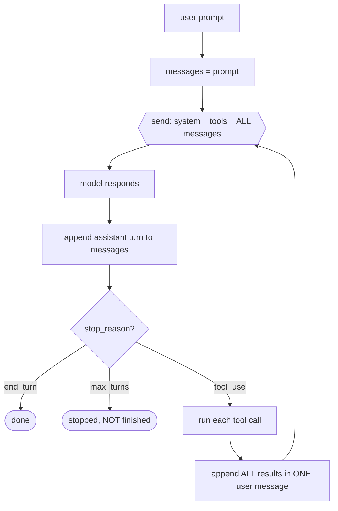
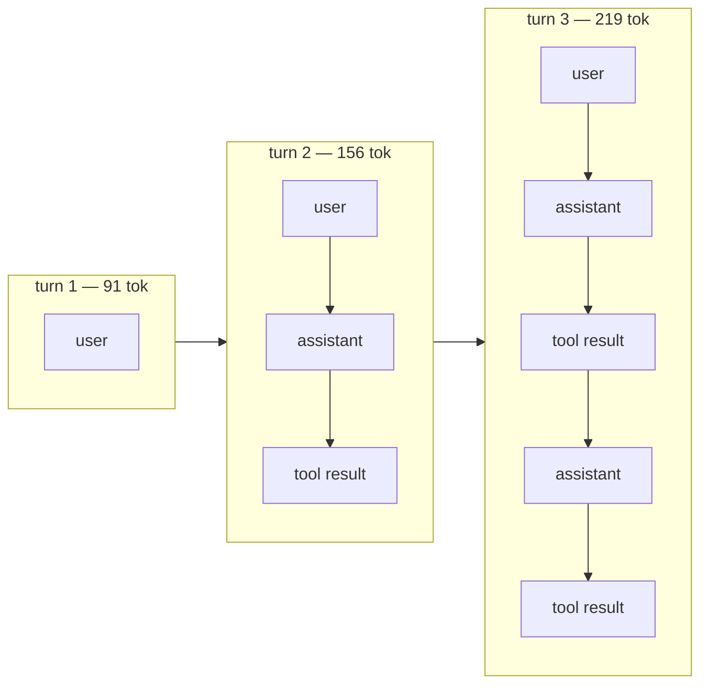
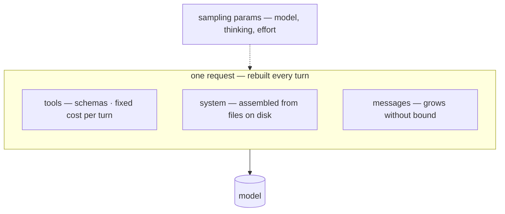
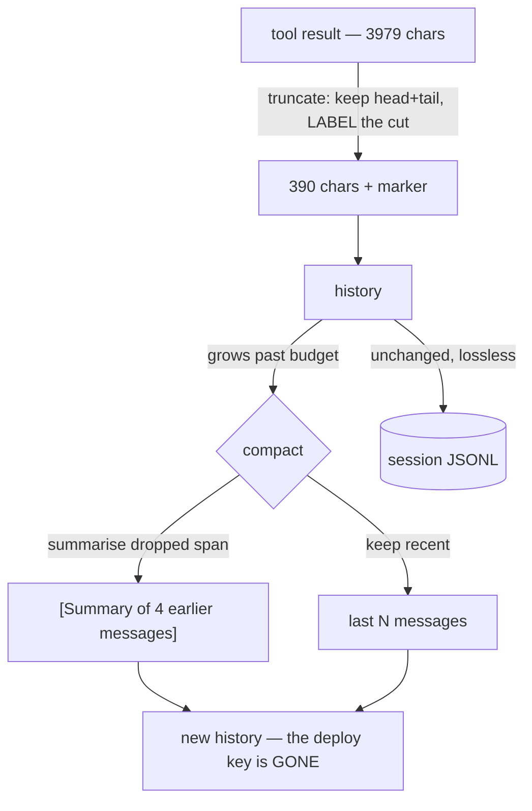
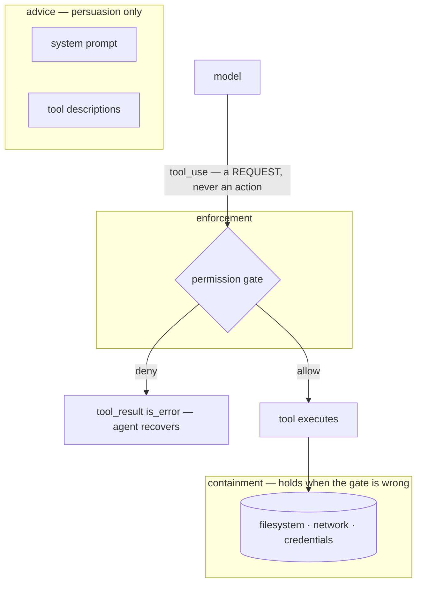
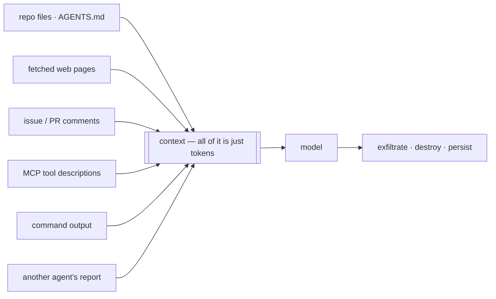
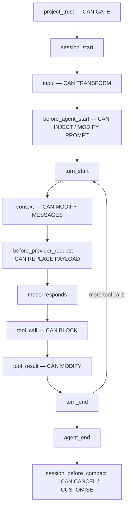
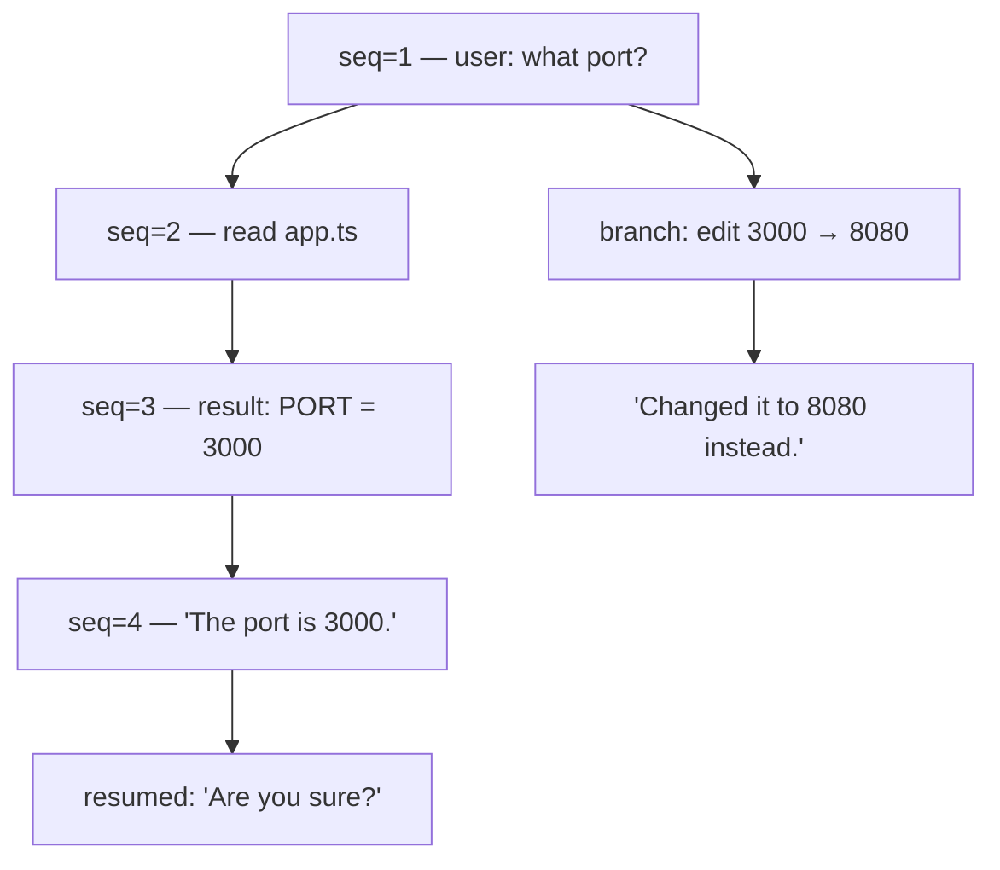

# Diagrams

Mermaid, so they render on GitHub and in most markdown viewers without a build step.
Each is paired with the lesson it belongs to and the one sentence it exists to make.

---

## 1. The loop (lesson 02)

> *The agent is a loop. Everything else is bolted onto it.*

Point at the edge from `J` back to `C`. That arrow is the whole subject: it re-sends
everything, every time.

---

## 2. Context is the only state (lesson 03)

> *Nothing persists. The request is rebuilt from scratch every turn.*

Real numbers from `build/transcripts/stage1-loop.txt`. The growth is not waste; it is
the memory.

---

## 3. What a request is made of (lesson 04)

> *Four surfaces, and only one of them is cheap to change.*

Render order is `tools` → `system` → `messages`. That order is why prompt caching
works the way it does: change anything early and everything after it is invalidated.

---

## 4. Truncation versus compaction (lesson 09)

> *One shortens a value. The other deletes history. Only one causes amnesia.*

The two arrows out of `H` are the design: lossy to the model, lossless to disk.

---

## 5. The trust boundary (lessons 10, 19)

> *The gate is the only enforcement. Everything above it is advice.*

The three boxes are the lesson. Most teams put safety properties in the top box.

---

## 6. Where untrusted text gets in (lesson 19)

> *Everything arrives as tokens. The model cannot tell data from instruction.*

Draw this, then ask which of the six inputs the audience has actually reviewed.

---

## 7. pi's intervention points (lesson 15)

> *Read the verbs. Interceptors let you govern; notifications only let you watch.*

Simplified from pi's own diagram — the full version is in
[`../reading/excerpts.md`](../reading/excerpts.md) §7. Capitalised verbs are the
interceptors; plain nodes are notifications.

---

## 8. Sessions as a tree (lesson 11)

> *Fork is not undo. Nothing is deleted.*

Both paths exist in the log at once. Rewinding to a good turn removes bad reasoning
instead of arguing with it — which is why fork beats correction.

---

## Drawing these live

If you are at a whiteboard rather than a screen, draw only **1**, **5** and **7** —
in that order. The loop, the trust boundary, the intervention points. Everything else
in the course can be said in words once those three are on the wall.
